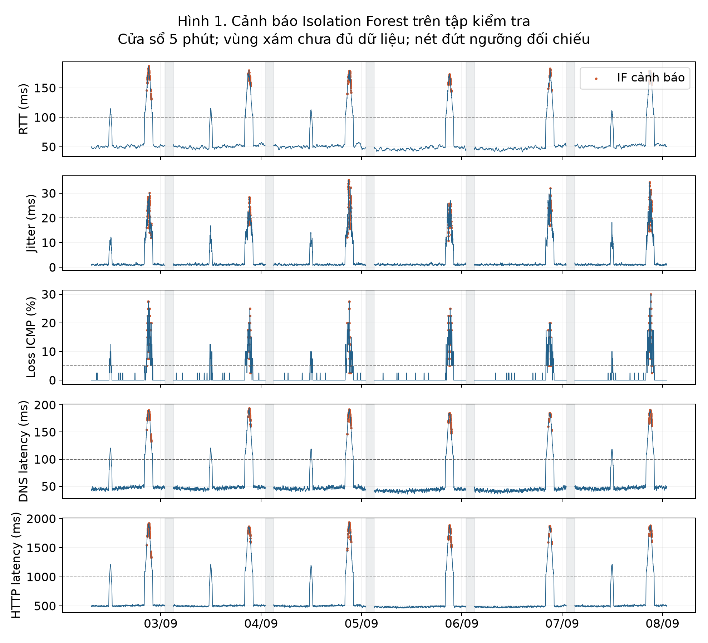
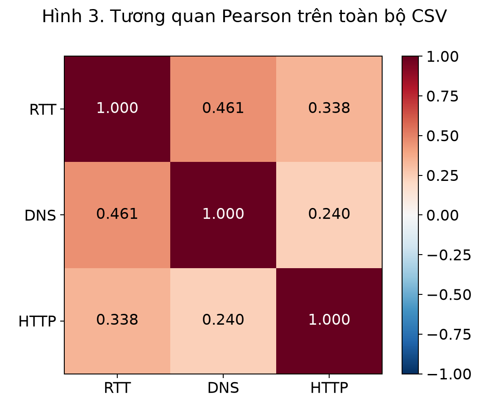
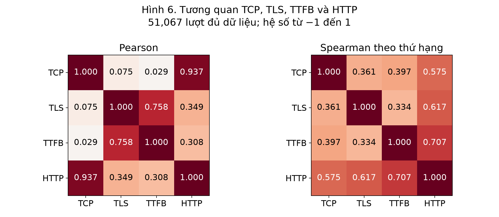
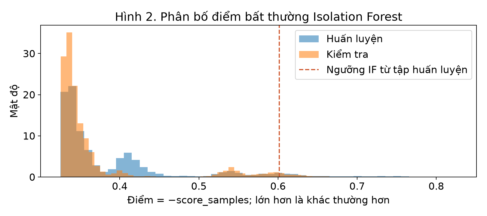
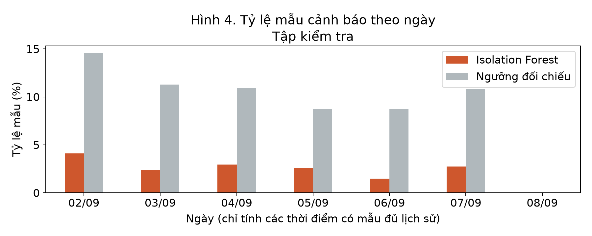
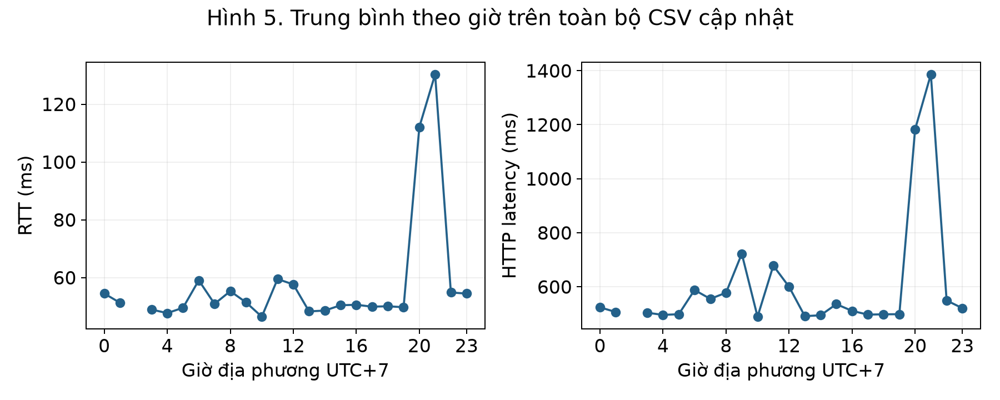
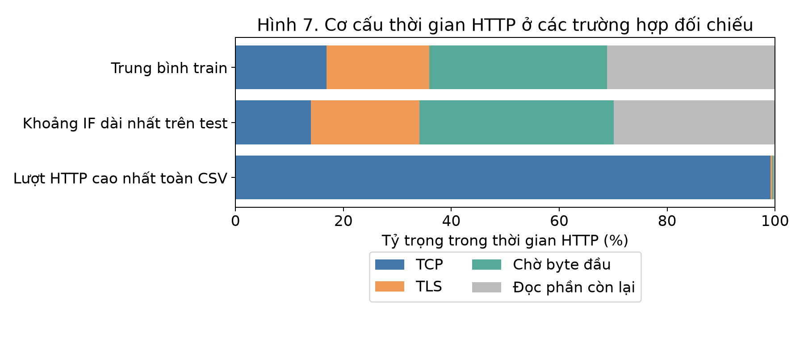

# Chương 1 Giới thiệu

## 1.1 Bối cảnh và vấn đề nghiên cứu

Khi học trực tuyến, tìm kiếm tài liệu hoặc sử dụng các trang web, người dùng có thể gặp tình trạng mạng chậm trong một khoảng thời gian rồi tự trở lại bình thường. Một lần kiểm tra kết nối chỉ cho biết tình trạng tại thời điểm kiểm tra. Nếu sự cố xảy ra trước đó, người dùng khó trả lời được mạng bắt đầu chậm lúc nào, kéo dài bao lâu và biểu hiện nào thay đổi rõ nhất. Vì vậy, cần ghi lại các phép đo theo thời gian để có căn cứ phân tích.

Chất lượng kết nối không thể được mô tả đầy đủ bằng một con số. Thời gian phản hồi của gói kiểm tra, mức dao động của thời gian phản hồi, khả năng nhận phản hồi, thời gian phân giải tên miền và thời gian thực hiện yêu cầu web phản ánh các khía cạnh khác nhau. Một máy tính có thể vẫn nhận phản hồi ping nhưng việc truy cập web lại chậm. Ngược lại, ping không nhận được phản hồi chưa đủ để khẳng định tất cả dịch vụ đều ngừng hoạt động.

Từ vấn đề này, tôi thực hiện đề tài T19: Phân tích và phát hiện các khoảng thời gian mạng suy giảm chất lượng từ dữ liệu đo định kỳ. Trọng tâm của bài là đọc hiểu số liệu mạng và xác định những khoảng cần kiểm tra. Machine Learning được sử dụng như một công cụ hỗ trợ tìm các mẫu khác thường trong dữ liệu.

## 1.2 Mục tiêu và câu hỏi nghiên cứu

Mục tiêu của tiểu luận là xây dựng một chương trình Python nhỏ, có thể chạy lại trên bộ dữ liệu cập nhật được cung cấp, để mô tả chất lượng kết nối theo thời gian và phát hiện các khoảng có dấu hiệu suy giảm. Chương trình cần xuất được biểu đồ, danh sách khoảng bất thường và các chỉ số giúp giải thích kết quả.

Bài nghiên cứu tập trung vào ba câu hỏi:

1. Các chỉ số chất lượng kết nối biến động như thế nào và những khoảng thời gian nào đáng chú ý?
2. Isolation Forest phát hiện các mẫu khác thường nào và quy tắc ngưỡng giúp đối chiếu kết quả ra sao?
3. Trong các khoảng được phát hiện, chỉ số nào tăng rõ nhất và RTT, DNS latency, HTTP latency có cùng biến động hay không?

Để trả lời các câu hỏi, tôi thực hiện lần lượt việc kiểm tra dữ liệu, tính các đặc trưng theo cửa sổ thời gian, áp dụng Isolation Forest và đối chiếu với quy tắc ngưỡng và xem lại các trường hợp cụ thể. Kết quả được giải thích bằng ý nghĩa của phép đo mạng, không chỉ dựa vào nhãn do chương trình tạo ra.

## 1.3 Phạm vi nghiên cứu

Đây là tiểu luận do một sinh viên thực hiện. Phương pháp chính là Isolation Forest, dùng các chỉ số đo theo thời gian để tìm những mẫu khác thường. Baseline theo ngưỡng chỉ là phương pháp đối chiếu dễ giải thích. Bài không dùng baseline làm nhãn đúng để huấn luyện hoặc chấm độ chính xác của mô hình.

Môi trường thu thập do tác giả cung cấp là Windows, kết nối Ethernet. Collector có cấu hình ping 8.8.8.8, phân giải www.google.com và thực hiện yêu cầu HTTPS tới www.google.com. Dữ liệu sử dụng là phiên bản CSV cập nhật gồm 51.070 dòng. Nguồn file và các điểm cần đối chiếu được trình bày ở Chương 3.

Phạm vi phân tích chỉ bao gồm các phép đo và thời điểm thực sự có trong file. Bài không đo thông lượng tối đa, không xác định router gây lỗi và không dùng khoảng trống trong CSV để kết luận mất mạng. Khi chưa có nhật ký sự cố độc lập, kết quả của mô hình được gọi là cảnh báo cần xem xét.

## 1.4 Phương pháp và sản phẩm dự kiến

Quy trình gồm sáu bước: đọc dữ liệu; làm sạch; phân tích thống kê; tạo đặc trưng; áp dụng Isolation Forest, đối chiếu baseline; đánh giá và trực quan hóa. Thứ tự thời gian được giữ nguyên khi thiết kế thực nghiệm. Thông tin của giai đoạn đánh giá không được dùng để học cách điền thiếu, chọn ngưỡng thống kê hoặc huấn luyện mô hình. Nguyên tắc này giúp tránh sử dụng thông tin tương lai để đánh giá dữ liệu quá khứ. [10]

Sản phẩm gồm mã Python, dataset thực sự được sử dụng, README hướng dẫn chạy, các biểu đồ có diễn giải và báo cáo sáu chương. Kết quả phát hiện có vai trò gợi ý những khoảng cần xem xét. Để khẳng định một cảnh báo đúng hay sai theo tình trạng thực tế, cần thêm nhật ký sự cố hoặc xác nhận độc lập.


## 1.5 Ý nghĩa của kết quả dự kiến

Sản phẩm cần trả lời được những câu hỏi như khoảng nào nên xem lại, chỉ số nào tăng rõ và một cảnh báo có kéo dài qua nhiều lượt đo hay không. Trọng tâm là giải thích điểm bất thường và các khoảng do Isolation Forest đánh dấu. Kết quả theo ngưỡng giúp người đọc có thêm mốc đối chiếu trực tiếp với đơn vị mili giây và phần trăm.

Một mô hình đánh dấu ít mẫu không tự động có nghĩa là chính xác hơn, cũng như nhiều cảnh báo không tự động có nghĩa là phát hiện đầy đủ sự cố. Bài sử dụng số cảnh báo, phân bố điểm, độ nhạy của ngưỡng và các trường hợp cụ thể để đánh giá. Precision, Recall và F1 chưa được tính khi không có nhãn sự cố đã xác nhận.

Trong bài cá nhân, tôi tập trung làm rõ một cửa sổ thời gian, một mô hình cơ bản và một quy tắc gộp khoảng. Khi cần giải thích một kết quả, có thể truy từ biểu đồ về intervals.csv, rồi xem từng lượt trong scored_data.csv. Cách làm này gắn phần lập trình với ý nghĩa phép đo mạng thay vì chỉ báo cáo một nhãn từ thuật toán.

# Chương 2 Cơ sở lý thuyết

## 2.1 Những thành phần mạng liên quan đến phép đo

Khi truy cập một địa chỉ HTTPS, máy tính cần có địa chỉ IP của máy chủ, thiết lập kết nối và trao đổi thông tin với dịch vụ web. Trong bộ thu thập này, yêu cầu web sử dụng HTTP/1.1 trên kết nối TCP có TLS. TCP cung cấp luồng dữ liệu có thứ tự và cơ chế truyền lại khi cần; việc thiết lập kết nối và truyền dữ liệu đều có thể góp phần vào thời gian chờ. [5], [6]

Ping sử dụng bản tin ICMP Echo Request và Echo Reply để kiểm tra khả năng nhận phản hồi từ một đích. [1] DNS phục vụ việc tra cứu thông tin tên miền. [4] HTTP thực hiện trao đổi yêu cầu và phản hồi ở tầng ứng dụng. [6] Ba phép đo này bổ sung cho nhau nhưng không hoàn toàn kiểm tra cùng một dịch vụ. Cụ thể, địa chỉ được ping trong chương trình là 8.8.8.8, còn địa chỉ máy chủ web được phân giải từ www.google.com.

Vì vậy, dữ liệu phù hợp để mô tả biểu hiện của kết nối tại máy đo. Dữ liệu chưa đủ để kết luận router nào bị lỗi, nhà cung cấp nào gây chậm hoặc máy chủ web đã quá tải.

## 2.2 RTT và độ dao động RTT

RTT, viết tắt của Round-Trip Time, là thời gian khứ hồi của một phép trao đổi từ nguồn tới đích và quay về. RTT chịu ảnh hưởng của cả đường đi lẫn đường về; không thể mặc định lấy RTT chia đôi để có độ trễ một chiều chính xác. [2]

Trong collector_goc.py, mỗi lượt ping dự kiến gửi bốn gói. Trường rtt_ms là trung bình RTT của các phản hồi mà chương trình đọc được. Nếu không nhận phản hồi nào, RTT bị thiếu vì không có giá trị để tính. Giá trị thiếu trong trường hợp này không có nghĩa là RTT bằng 0 ms.

Jitter thường được dùng để nói tới sự biến động độ trễ, nhưng cần nêu rõ cách tính. RFC 3393 định nghĩa độ biến thiên dựa trên chênh lệch độ trễ một chiều của các gói được chọn. [3] Bộ thu thập của bài sử dụng một cách đo khác: lấy trung bình chênh lệch tuyệt đối giữa các RTT liên tiếp trong danh sách phản hồi của cùng một lượt ping.

Công thức trong bài là jitter = tổng |RTT kế tiếp − RTT trước| / (số phản hồi − 1). Ví dụ minh họa, bốn RTT bằng 20, 21, 40 và 22 ms cho jitter bằng (1 + 19 + 18) / 3 = 12,67 ms. Đây là số liệu minh họa công thức, không phải kết quả thực nghiệm. Nếu chỉ có một phản hồi thì không đủ để tính jitter. Báo cáo gọi chỉ số này là độ dao động RTT trong một lượt đo để tránh nhầm với phép đo độ trễ một chiều.

## 2.3 Tỷ lệ không nhận phản hồi ICMP

Trường loss_rate phản ánh tỷ lệ gói ping không có phản hồi theo kết quả mà chương trình đọc được. Với số gói gửi hợp lệ, cách tính là loss_rate = (n_sent − n_received) / n_sent. Nếu gửi bốn gói và nhận ba phản hồi thì tỷ lệ bằng 0,25, tương ứng 25%. Trong file CSV, giá trị được lưu trong khoảng 0 đến 1; khi trình bày theo phần trăm phải nhân với 100.

Collector ưu tiên tỷ lệ loss trong dòng tổng kết của lệnh ping; công thức từ số đếm là cách dự phòng khi không đọc được tỷ lệ đó. Vì vậy, cần đối chiếu hai thông tin nếu chúng không khớp.

Do mỗi lượt chỉ gồm bốn gói, tỷ lệ ở một lượt đo có bước thay đổi lớn. Một phản hồi bị thiếu đã làm tỷ lệ tăng lên 25%. Vì vậy, cần xem nhiều lượt gần nhau trước khi nhận xét mức độ kéo dài của hiện tượng.

ICMP là loại bản tin cụ thể được dùng trong phép thử. [1] Khi một phản hồi không đến, bộ dữ liệu không xác định được gói yêu cầu hay gói trả lời bị mất, phản hồi quá muộn hay ICMP bị hạn chế. Vì vậy, loss_rate không phải tỷ lệ mất của tất cả gói TCP/UDP trên mạng. Lỗi gọi lệnh ping hoặc lỗi đọc kết quả cũng có thể tạo biểu hiện tương tự và cần xem lại cách đo và log.

## 2.4 DNS latency

DNS tổ chức thông tin tên miền theo hệ thống phân cấp và cho phép lưu kết quả trong bộ nhớ đệm. Nhờ bộ nhớ đệm, một truy vấn có thể được trả lời mà không phải lặp lại toàn bộ quá trình tra cứu. [4]

Trong chương trình, dns_latency_ms là thời gian thực hiện thao tác phân giải tên miền. Nếu có dnspython, chương trình gửi truy vấn bản ghi A tới resolver 8.8.8.8. Cách này tránh đường tra cứu qua bộ nhớ đệm DNS của hệ điều hành, nhưng resolver vẫn có thể dùng bộ nhớ đệm của chính nó. Nếu thiếu thư viện, chương trình dùng socket.getaddrinfo và chịu ảnh hưởng của cơ chế phân giải tên miền trên máy.

DNS latency cao cho thấy thao tác phân giải chậm ở lần đo đó. Đây chưa phải bằng chứng rằng DNS làm cho yêu cầu HTTP trong cùng dòng bị chậm, vì hai phép đo chạy riêng và có thể đi qua các bước phân giải khác nhau.

## 2.5 HTTP latency và các thành phần thời gian

HTTP là giao thức trao đổi yêu cầu và phản hồi; HTTPS dùng kết nối được bảo vệ bằng TLS. [6] Trong bài này, http_latency_ms được tính từ trước khi tạo kết nối tới khi vòng đọc phản hồi kết thúc. Thời gian này gồm nhiều bước: phân giải tên miền trong hàm tạo kết nối, kết nối TCP, chuẩn bị và thương lượng TLS, gửi yêu cầu, chờ dữ liệu đầu tiên và đọc dữ liệu tiếp theo.

Cần đọc tên trường theo đúng mã nguồn. tcp_connect_ms bao gồm cả thao tác phân giải tên miền bên trong socket.create_connection, nên không hoàn toàn là thời gian bắt tay TCP. tls_handshake_ms còn tính thời gian chuẩn bị ngữ cảnh TLS. ttfb_ms được tính từ sau bước TLS tới khi nhận byte đầu tiên; đây không phải TTFB tính từ đầu toàn bộ yêu cầu.

Vòng đọc phản hồi có thể dừng khi hết thời gian chờ hoặc vượt giới hạn dung lượng nhưng vẫn trả về http_latency_ms. Vì vậy, chỉ số này không đảm bảo rằng trang web đã được tải đầy đủ. Việc HTTP chậm cũng có thể liên quan tới kích thước phản hồi hoặc xử lý ở máy chủ. Không thể chỉ dùng thời gian HTTP để khẳng định tốc độ đường truyền thấp.

## 2.6 Dữ liệu theo thời gian và cửa sổ trượt

Mỗi dòng dữ liệu gắn với một thời điểm đo. Việc sắp xếp timestamp giúp thấy được diễn biến trước và sau một cảnh báo. Cần kiểm tra khoảng cách thực tế giữa hai dòng vì máy tính có thể nghỉ, chương trình có thể dừng hoặc một lượt đo kéo dài hơn dự kiến. Một số lượng dòng lớn không tự chứng minh rằng dữ liệu phủ đều tất cả giờ trong ngày.

Cửa sổ trượt là một nhóm quan sát gần thời điểm đang xét. Khi chuyển sang thời điểm tiếp theo, cửa sổ cũng dịch chuyển theo. pandas hỗ trợ cửa sổ theo số dòng hoặc theo khoảng thời gian; cửa sổ theo thời gian có thể chứa số dòng khác nhau nếu phép đo không đều. [9]

Trong bài, trung bình trong cửa sổ mô tả mức thông thường; độ lệch chuẩn mô tả mức phân tán; percentile mô tả vị trí tương đối trong phân bố. Ví dụ, P95 là mức mà khoảng 95% giá trị không vượt quá. P95 giúp mô tả phần giá trị cao mà trung bình có thể làm mờ. Các thống kê này phải đi kèm số quan sát hợp lệ: P95 từ rất ít điểm sẽ kém ổn định.

Thông tin giờ trong ngày giúp xem hiện tượng có tập trung ở một thời điểm nhất định hay không. Đây là đặc trưng thời gian, không phải bằng chứng về nguyên nhân. Cửa sổ dùng để cảnh báo tại thời điểm hiện tại chỉ được lấy các quan sát đã có tới thời điểm đó.

## 2.7 Isolation Forest và ngưỡng đối chiếu

Isolation Forest phát hiện điểm khác thường bằng cách liên tục chia dữ liệu theo đặc trưng và giá trị được chọn ngẫu nhiên. Điểm ít giống phần lớn dữ liệu thường được tách riêng sau ít bước hơn. Kết quả được tổng hợp từ nhiều cây để tính mức bất thường. [7]

Mô hình không cần có sẵn nhãn sự cố. Trong scikit-learn, predict trả về −1 cho điểm bị đánh dấu bất thường và 1 cho điểm còn lại. decision_function có giá trị thấp hơn đối với điểm bất thường hơn; ngưỡng phân loại là 0. Tham số contamination ảnh hưởng tới ngưỡng dựa trên dữ liệu huấn luyện, không phải tỷ lệ sự cố thực tế đã được xác minh. [8]

Một mẫu hiếm chưa chắc thể hiện chất lượng xấu. Chẳng hạn, độ trễ giảm mạnh cũng có thể khác với dữ liệu thường gặp. Vì vậy, khi đọc kết quả Isolation Forest cần xem chỉ số nào thay đổi, thay đổi theo chiều nào và có kéo dài hay không. Mô hình hỗ trợ chọn trường hợp để kiểm tra; người phân tích vẫn phải đối chiếu các giá trị mạng.

Baseline là phương pháp đối chiếu đơn giản. Trong bài, một quy tắc ngưỡng đánh dấu những phép đo có chỉ số vượt mức đã quy định. Ưu điểm là dễ đọc và dễ giải thích: người xem biết chỉ số nào làm phát sinh cảnh báo. Hạn chế là một ngưỡng cố định có thể không phù hợp với mọi máy đo và mọi đích. Các giá trị ngưỡng trong thực nghiệm là lựa chọn của bài, không được coi là chuẩn chất lượng chung của Internet.

## 2.8 Nguyên tắc đánh giá và diễn giải

Khi chưa có nhãn sự cố độc lập, bài có thể báo cáo số cảnh báo, tỷ lệ cảnh báo, anomaly score, số khoảng bất thường và mức giao nhau giữa hai phương pháp. Mức giao nhau thể hiện hai phương pháp có đồng ý với nhau hay không. Nó không đo được độ đúng thực tế, vì baseline cũng có thể bỏ sót hoặc cảnh báo nhầm.

Precision, Recall và F1 cần phân biệt được cảnh báo đúng, cảnh báo sai và sự cố bị bỏ sót. Nếu lấy nhãn baseline làm đáp án rồi tính các chỉ số này cho mô hình, kết quả chỉ cho biết mức giống baseline. Bài không sử dụng cách đó để tuyên bố độ chính xác phát hiện sự cố.

Khi phân tích RTT, DNS và HTTP, biểu đồ và hệ số tương quan cho biết các chỉ số có cùng biến động trong những quan sát hợp lệ hay không. Tương quan không xác định quan hệ nguyên nhân. Những khoảng được đánh dấu cần được mô tả bằng thời điểm, số phép đo, chỉ số tăng và giới hạn quan sát. Với dữ liệu định kỳ, thời điểm bắt đầu và kết thúc là mốc quan sát, không phải thời điểm sự cố thực tế được biết chính xác.

# Chương 3 Dataset và phương pháp

## 3.1 Nguồn dữ liệu và đối chiếu log

Dataset network_quality_data1.csv có 51.070 dòng, được thu trên Windows dùng Ethernet. Cả 51.070 bản ghi có số đo tương ứng trong network_quality_data1.log, gồm hai mốc 03:00 ngày 20/08 và 21/08. CSV và log dùng trong bài nằm ở thư mục du_lieu.

Dòng khởi động trong log ghi chu kỳ 1 giây, còn collector được cung cấp cấu hình 30 giây và các mốc ghi thường cách nhau 30 giây. Bài tính cửa sổ theo timestamp thực tế và ghi nhận khác biệt này.

Log là nguồn đối chiếu số đo, không phải nhãn sự cố độc lập. Có 428 dòng cuối trùng các trường số với bản trước từng qua biên tập; sự khớp CSV–log chưa giải thích lịch sử phần trùng đó. Bài không tự xác nhận mọi dòng là số đo nguyên trạng và không dùng lịch suy giảm cũ làm nhãn.

## 3.2 Đơn vị quan sát và cách lấy mẫu

Task Scheduler được cấu hình cho collector hoạt động từ 03:00 đến 01:00 hôm sau, nghỉ từ 01:00 đến 03:00 hằng ngày. Mỗi dòng là một lượt đo cho target google, với chu kỳ cấu hình 30 giây. Timestamp được lấy trước các phép ping, DNS và HTTP nối tiếp nên chúng không được đo đồng thời tuyệt đối. Cửa sổ được tính theo timestamp thực tế.

*Bảng 3.1 Thông tin phiên bản CSV cập nhật*

| Nội dung | Kết quả kiểm tra |
| --- | --- |
| Số dòng và cột nguồn | 51.070 dòng, 15 cột |
| Mẫu đầu | 19/08/2026 17:34:00 UTC+7 |
| Mẫu cuối | 08/09/2026 01:00:00 UTC+7 |
| Target | google |
| Trùng dòng hoặc timestamp/target | 0 |
| Khoảng cách thông thường | 30 giây |
| Khoảng ngắt trên 60 giây | 19, tạo 20 phiên |
| Khoảng ngắt đúng 60 giây | 2 |
| Vị trí vắng trên lưới 30 giây | 4.543: 4.541 ngoài lịch, 2 trong lịch đo |

Từ mẫu đầu tới mẫu cuối là 19 ngày 7 giờ 26 phút, đi qua 21 ngày lịch; ngày đầu và cuối chỉ có một phần ngày. Có 19 khoảng ngắt gần hai giờ, phù hợp lịch nghỉ thu thập. Các phiên đầy đủ có số đo từ 03:00. Các khoảng nghỉ theo lịch không được tính là dấu hiệu mất mạng.

Việc đếm tính cả mẫu đúng 01:00 trong lịch đo. Hai mốc trong giờ chạy chưa có mẫu là 22/08 lúc 20:35:30 và 20:54:30. Các vị trí ngoài lịch được xem là thời gian nghỉ thu thập.

Quy mô hơn năm mươi nghìn dòng cho phép thực hiện thống kê và một mô hình cơ bản. Tuy nhiên, chỉ có một cấu hình đích và các cửa sổ chồng lấp không độc lập. Kết quả chưa đại diện cho các nhà mạng, vị trí hoặc cách sử dụng khác.

Tỷ lệ cảnh báo theo ngày dùng mẫu đủ lịch sử trong scored_data.csv; trung bình theo giờ dùng số đo hợp lệ trong cleaned_data.csv. Giờ 01 chỉ có mốc 01:00, giờ 02 không được đo. Không điền số 0 cho giờ nghỉ.

## 3.3 Data dictionary

Bảng 3.2 mô tả toàn bộ schema. Năm trường RTT, jitter, loss, DNS và HTTP là nội dung phân tích chính. Các trường còn lại dùng để hiểu hoặc kiểm tra phép đo. Chỉ có một target nên bài không cần mã hóa biến phân loại target_id thành nhiều cột.

*Bảng 3.2 Từ điển dữ liệu*

| Trường | Kiểu và đơn vị | Cách hiểu trong bài |
|---|---|---|
| timestamp | Thời gian có múi giờ | Mốc bắt đầu lượt đo |
| target_id | Chuỗi | Nhãn cấu hình đích; ở đây là google |
| rtt_ms | Số thực, ms | RTT trung bình của phản hồi ping |
| rtt_min_ms | Số thực, ms | RTT thấp nhất trong lượt |
| rtt_max_ms | Số thực, ms | RTT cao nhất trong lượt |
| jitter_ms | Số thực, ms | Trung bình chênh lệch tuyệt đối RTT liên tiếp |
| n_sent | Số nguyên, gói | Số ping dự kiến gửi; ở đây là 4 |
| n_received | Số nguyên, gói | Số phản hồi đọc được |
| loss_rate | Số thực, 0 đến 1 | Tỷ lệ không nhận phản hồi ping |
| dns_latency_ms | Số thực, ms | Thời gian phép phân giải tên miền riêng |
| tcp_connect_ms | Số thực, ms | Bao gồm phân giải hệ thống và tạo TCP |
| tls_handshake_ms | Số thực, ms | Bao gồm chuẩn bị ngữ cảnh và bước TLS |
| ttfb_ms | Số thực, ms | Từ sau bước TLS đến byte phản hồi đầu |
| http_latency_ms | Số thực, ms | Từ bắt đầu kết nối tới khi vòng đọc kết thúc |
| http_status_code | Số nguyên | Mã phản hồi HTTP đọc được |

Ví dụ dòng đầu có RTT 42,75 ms, jitter 0,667 ms, nhận 4/4 phản hồi, loss bằng 0, DNS 42,111 ms và HTTP 512,97 ms. Ý nghĩa của dòng là mô tả một lượt quan sát trong file. HTTP khoảng nửa giây không phải RTT khoảng nửa giây, vì thời gian HTTP gồm nhiều công đoạn hơn một phép ping.


## 3.4 Làm sạch và kiểm tra chất lượng

Timestamp được chuyển về kiểu thời gian với múi giờ UTC+7 rồi sắp xếp tăng dần. File không có dòng trùng hoàn toàn hoặc khóa thời điểm/target xung đột. Chương trình vẫn giữ quy tắc phát hiện hai dạng lỗi này khi chạy lại trên dữ liệu khác: loại trùng hoàn toàn, dừng nếu một thời điểm có hai bộ số đo khác nhau chưa được giải thích.

*Bảng 3.3 Giá trị thiếu của năm chỉ số chính*

| Chỉ số | Số giá trị thiếu | Cách xử lý |
| --- | --- | --- |
| RTT | 2 | Giữ thiếu, không gán 0 ms |
| Jitter | 2 | Không suy ra độ dao động khi mất hết phản hồi |
| Loss | 0 | Giữ giá trị nguồn; đánh dấu một dòng không khớp số đếm |
| DNS latency | 4 | Giữ thiếu, đối chiếu nhật ký |
| HTTP latency | 3 | Giữ thiếu, không coi là phản hồi nhanh |

Có năm dòng thiếu ít nhất một chỉ số chính. Hai dòng lúc 07:52:30 và 07:53:00 ngày 31/08 không nhận phản hồi ping, RTT và jitter để trống, loss bằng 1. Không có dòng nào cần sửa jitter từ 0 thành thiếu như ở phiên bản trước. File missing_measurements.csv giúp xem riêng các lượt thiếu thay vì coi giá trị không đo được là chất lượng tốt.

Hai dòng trên còn có mã HTTP 200 trong khi các thời gian HTTP đều trống. Ngoài ra, dòng 27/08 lúc 06:40 ghi nhận 2/4 phản hồi nhưng loss bằng 0. Đây là các điểm không nhất quán cần xem lại cách đo và log. Chương trình đánh dấu chúng trong data_quality_notes.csv và giữ số liệu nguồn; không tự khẳng định số đếm hoặc tỷ lệ nào là đúng. Việc diễn giải riêng các dòng này cần thận trọng.

Các giá trị âm hoặc vô hạn, nếu có, được đổi thành thiếu. Các giá trị cao vẫn giữ lại để xem xét sự cố hoặc lỗi phép đo. Cần đối chiếu nhật ký trước khi giải thích nguyên nhân.

Cửa sổ thống kê bỏ qua ô thiếu trong phép tính, nhưng chỉ thực hiện khi có ít nhất ba giá trị hợp lệ. Nếu feature còn thiếu, bộ điền thiếu sử dụng trung vị học từ train. Không điền ngược bằng dữ liệu tương lai và không học trung vị từ cả test. Trong lần chạy này, còn 0 ô feature cần thay thế sau bước tạo cửa sổ và bỏ khởi động.

Một phiên mới bắt đầu khi khoảng cách hai lượt lớn hơn 60 giây. cleaned_data.csv giữ 51.070 dòng; bước tạo feature mới bỏ các lượt đầu chưa đủ lịch sử.

## 3.5 Tạo đặc trưng theo thời gian

Để tránh đánh giá chỉ từ một lần ping, bài dùng cửa sổ trượt 5 phút. Tại thời điểm t, cửa sổ là (t − 5 phút, t], tức chỉ dùng hiện tại và quá khứ. Với khoảng lấy mẫu 30 giây, khi đã đủ lịch sử mỗi cửa sổ có 10 dòng. Hai dòng đầu mỗi phiên bị bỏ khỏi phần mô hình vì chưa đủ ba thời điểm. Với 20 phiên, loại 40 dòng khởi động và còn 51.030 dòng đặc trưng.

*Bảng 3.4 Chín đặc trưng đầu vào mô hình*

| Đặc trưng | Số cột | Mục đích |
|---|---:|---|
| Trung bình RTT, jitter, loss, DNS, HTTP trong 5 phút | 5 | Mô tả mức chất lượng gần thời điểm xét |
| Độ lệch chuẩn RTT trong 5 phút | 1 | Mô tả mức dao động giữa các lượt |
| P95 RTT trong 5 phút | 1 | Phản ánh phần RTT cao trong cửa sổ |
| P95 HTTP trong 5 phút | 1 | Phản ánh phần HTTP latency cao |
| Giờ cộng phút chia 60 | 1 | Bổ sung bối cảnh giờ trong ngày |

Độ lệch chuẩn RTT giữa các lượt khác với jitter trong một lượt. Chẳng hạn, một lượt có các phản hồi gần nhau nên jitter thấp, nhưng trung bình RTT của nhiều lượt vẫn có thể tăng dần. Việc giữ hai đặc trưng này giúp quan sát hai mức biến động khác nhau.

Giờ được đưa vào dưới dạng số. Không sử dụng lịch kịch bản như feature hoặc target để fit Isolation Forest.

Bài không dùng StandardScaler cho Isolation Forest vì mô hình chia dữ liệu theo từng đặc trưng bằng cây, không dựa vào khoảng cách Euclid như K-Means. Việc so sánh mức tăng giữa các chỉ số ở Chương 5 có phép chia cho độ phân tán riêng; đó là bước diễn giải, không phải bước chuẩn hóa đầu vào mô hình.


## 3.6 Thiết kế đánh giá Isolation Forest

Sau khi tạo feature theo chiều thời gian, 70% dòng đầu dùng cho train và 30% cuối dùng cho test. Train có 35.721 dòng, kết thúc lúc 07:23:00 ngày 02/09/2026. Test có 15.309 dòng, bắt đầu lúc 07:23:30 cùng ngày. Bộ điền thiếu và Isolation Forest chỉ fit trên train; test được giữ để xem mô hình phản ứng với giai đoạn sau.

Cửa sổ đầu test có thể sử dụng lịch sử ở cuối train vì các mẫu đó đã có tại thời điểm quyết định. Nó không lấy số liệu tương lai. Các cửa sổ vẫn chồng lấp nên bài không tính khoảng tin cậy theo giả định mọi dòng độc lập, và không trộn ngẫu nhiên train/test.

Chưa có nhãn sự cố độc lập nên chỉ tiêu chính là anomaly score, tỷ lệ cảnh báo, số khoảng liên tiếp, thời gian được cảnh báo hỗ trợ và mức tăng của từng chỉ số. Việc xem lại một khoảng dài, một cảnh báo ngắn và một mẫu không bị đánh dấu giúp kiểm tra tính hợp lý dưới góc độ mạng.

Baseline chỉ làm mốc đối chiếu; số mẫu trùng nhau thể hiện mức đồng thuận, không phải số dự đoán đúng.

# Chương 4 Xây dựng chương trình và thực nghiệm

## 4.1 Kiến trúc chương trình

Bộ bài có hai file Python: collector_goc.py thu số đo, phan_tich.py đọc CSV và phân tích. Mỗi bước nằm trong một hàm để sinh viên có thể lần theo từ dữ liệu đến kết quả.

Thực nghiệm dùng CSV có sẵn: làm sạch, tạo đặc trưng, chạy Isolation Forest, đối chiếu baseline, gộp khoảng và vẽ biểu đồ. Phân tích không phát sinh phép đo mạng.

*Bảng 4.1 Các thành phần của bộ chương trình*

| Thành phần | Chức năng |
|---|---|
| collector_goc.py | Thu định kỳ theo chu kỳ 30 giây; chạy liên tục và dừng bằng Ctrl+C |
| phan_tich.py | Toàn bộ pipeline phân tích và mô hình |
| du_lieu | Chứa CSV 51.070 dòng và log đối chiếu |
| ket_qua | Chứa bảng số liệu, điểm bất thường, khoảng cảnh báo và hình |
| README.md | Cài môi trường, lệnh chạy, kết quả mong đợi |

Trong phan_tich.py, read_and_clean kiểm tra dữ liệu; make_features tạo cửa sổ; build_intervals gộp cảnh báo; make_figures tạo hình. Phân tích HTTP bổ sung nằm trong một hàm riêng. Báo cáo trích đoạn mã cần giải thích; source đầy đủ nộp kèm.

## 4.2 Thu thập định kỳ và ghi nhật ký

collector_goc.py gửi bốn ping, thực hiện một phép DNS rồi gửi một yêu cầu HTTPS. Chương trình chỉ chạy liên tục theo INTERVAL_SECONDS và dừng bằng Ctrl+C. Ba hàm đo giữ nguyên; phần mô tả và import thừa đã được dọn cho khớp hành vi.

```python
while True:
    cycle_start = time.time()

    rows = collect_once_all_targets()
    for row in rows:
        append_csv(row)
        logging.info(f"Da ghi: {row}")

    elapsed = time.time() - cycle_start
    sleep_time = max(0, INTERVAL_SECONDS - elapsed)
    time.sleep(sleep_time)
```

Đoạn trích là vòng lặp trong main. Chạy python collector_goc.py để thu thêm. Trước khi chạy, sửa OUTPUT_CSV sang file mới trong một thư mục đã tồn tại. Giá trị hiện tại là đường dẫn tuyệt đối trên máy ban đầu; nhật ký collector.log được ghi vào thư mục làm việc. Giữ số đo mới riêng với CSV dùng trong báo cáo.

Task Scheduler quản lý giờ hoạt động 03:00 đến 01:00 hôm sau; collector quản lý chu kỳ trong thời gian đó. Không chạy chồng nhiều collector. phan_tich.py chỉ đọc CSV ngoại tuyến, không tạo traffic mạng.

Chu kỳ cấu hình là 30 giây, dự kiến khoảng tám ping, hai phép DNS và hai yêu cầu HTTPS mỗi phút với một target. Đây là số thao tác logic, không phải tổng số gói. Nếu lượt đo quá 30 giây, thời gian nghỉ bằng 0 và lượt tiếp theo bắt đầu sau khi lượt trước kết thúc. Không chạy bù những lượt bị lỡ.

Log đối chiếu có 51.070 dòng số đo và 20 thông báo khởi động ở mức INFO. Không có WARNING hay ERROR chưa xác nhận mạng luôn tốt. Các phép thu chỉ thực hiện trên máy và mạng được phép; không quét cổng, thu dữ liệu cá nhân hoặc tạo tải để gây suy giảm.

## 4.3 Thực hiện bước làm sạch

read_and_clean kiểm tra có đủ timestamp và năm chỉ số tối thiểu. Sau khi đọc thời gian, chương trình sắp xếp theo timestamp và phát hiện các dòng trùng. Các phép kiểm tra này có mục đích bảo đảm thứ tự thực sự dùng trong cửa sổ, không chỉ để file trông gọn hơn.

```python
bad = (df.n_received < 2) & df.jitter_ms.notna()
df.loc[bad, "jitter_ms"] = np.nan
```

Đoạn mã trích lược minh họa quy tắc quan trọng nhất của dữ liệu này. Khi số phản hồi nhỏ hơn hai, không đủ thông tin tính chênh lệch giữa hai RTT. Dùng NaN giữ đúng nghĩa chưa đo được. Nếu thay bằng 0, chương trình sẽ hiểu nhầm lượt ít phản hồi là lượt có độ dao động rất thấp.

Sau làm sạch, cleaned_data.csv giữ 51.070 dòng. File mới không có jitter cần sửa vì số phản hồi dưới hai; những ô RTT, jitter, DNS và HTTP đã thiếu được giữ đúng nghĩa. Chương trình xuất riêng năm lượt có chỉ số thiếu và ba lượt có điểm không nhất quán để đối chiếu. Không xóa dòng chỉ vì RTT hoặc HTTP cao.

summary.json lưu số dòng, giá trị thiếu, khoảng thời gian, cấu hình và phiên bản thư viện. CSV và log được nộp kèm để đối chiếu. Khi đổi phiên bản CSV cần chạy lại toàn bộ phân tích, vì thêm vài dòng cũng có thể làm các mẫu cây chọn ngẫu nhiên thay đổi dù giữ cùng random_state.

## 4.4 Tính cửa sổ và đặc trưng

```python
roll = group[METRICS].rolling("5min", min_periods=3)
features = roll.mean().add_suffix("_mean")
features["rtt_std"] = roll["rtt_ms"].std(ddof=0)
features["http_p95"] = roll["http_latency_ms"].quantile(0.95)
```

Ở đây group là dữ liệu của một phiên đã đặt timestamp làm chỉ mục. rolling dùng khoảng thời gian thật, không mặc định năm phút luôn là năm dòng. min_periods=3 đòi hỏi ít nhất ba giá trị hợp lệ cho thống kê tương ứng. Chương trình còn tính P95 RTT và đặc trưng giờ như Bảng 3.4.

Ví dụ khi xét lúc 20:03:00 với lịch đều 30 giây, cửa sổ dùng từ 19:58:30 đến 20:03:00. Những giá trị trước 20:00 có thể vẫn còn bình thường. Do đó, ngay sau khi bắt đầu đoạn suy giảm, trung bình 5 phút có thể chưa tăng đủ cao để vượt ngưỡng. Ngược lại, sau lúc kết thúc, cửa sổ vẫn giữ một phần giá trị trước đó và cảnh báo có thể kéo dài thêm.

Ảnh hưởng này là đánh đổi của phép làm mượt. Cửa sổ ngắn phản ứng nhanh nhưng nhạy với dao động đơn lẻ. Cửa sổ dài giảm dao động nhưng phản ứng chậm hơn. Bài chọn 5 phút làm cấu hình chính để giữ cách tính dễ hiểu, không khẳng định đây là cửa sổ tối ưu cho mọi mục đích sử dụng.

## 4.5 Huấn luyện Isolation Forest

```python
imputer.fit(train_features)
model = IsolationForest(
    n_estimators=100, max_samples=256,
    contamination=0.05, random_state=42, n_jobs=1)
model.fit(imputer.transform(train_features))
```

Đoạn mã trích lược thể hiện việc chỉ học từ train. Bộ điền thiếu tính trung vị trên train; mô hình nhận các đặc trưng đã xử lý của train. Khi chuyển sang test, chỉ gọi transform và dự đoán, không gọi fit lại. Chia theo thời gian là một lựa chọn cần thiết để mô phỏng sử dụng thông tin trước đó cho giai đoạn sau. [10]

Mô hình có 100 cây, mỗi cây dùng tối đa 256 mẫu để xây dựng các phép chia. random_state=42 giúp giữ tính lặp lại trong cùng môi trường. contamination=0,05 là lựa chọn cho cấu hình chính. Sau khi huấn luyện, ngưỡng tương ứng trên thang điểm của bài là khoảng 0,601695. Mẫu có điểm cao hơn ngưỡng bị đánh dấu bất thường.

Điểm được lưu bằng âm của score_samples, để giá trị lớn hơn dễ hiểu là khác thường hơn. Điểm này không phải xác suất mất mạng. Một mẫu có điểm 0,7 không có nghĩa xác suất sự cố bằng 70%. Nhãn của mô hình được chuyển từ −1 thành True để thuận tiện thống kê và xuất CSV.

Thực nghiệm bổ sung xem tỷ lệ cảnh báo thay đổi khi ngưỡng tương ứng contamination 0,02; 0,05; 0,10. Các ngưỡng được lấy từ phân vị điểm train của cùng rừng đã fit. Không chọn cấu hình vì muốn tăng số cảnh báo test. Nếu muốn tối ưu tham số, cần tách thêm validation theo thời gian rồi chỉ dùng test một lần cho cấu hình cuối.

## 4.6 Ngưỡng đơn giản dùng để đối chiếu

Baseline dùng năm giá trị trung bình trượt. Một mẫu được đánh dấu nếu ít nhất một chỉ số vượt ngưỡng ở Bảng 4.2. Dấu so sánh là lớn hơn nghiêm ngặt. Chẳng hạn loss trung bình đúng 0,05 chưa vượt ngưỡng 5%, còn 0,075 thì vượt.

*Bảng 4.2 Ngưỡng baseline trong thực nghiệm*

| Chỉ số trung bình 5 phút | Ngưỡng cảnh báo |
|---|---:|
| RTT | Trên 100 ms |
| Jitter | Trên 20 ms |
| Tỷ lệ không nhận phản hồi ICMP | Trên 5% |
| DNS latency | Trên 100 ms |
| HTTP latency | Trên 1.000 ms |

Các ngưỡng là quy tắc minh họa được lựa chọn cho bài, không được lấy từ một cam kết chất lượng dịch vụ cụ thể. Ưu điểm của baseline là giải thích được trực tiếp: có chỉ số trung bình nào đã vượt mức. Nhược điểm là một mẫu khác thường nhưng chưa vượt ngưỡng sẽ không được đánh dấu, còn mức bình thường của một đường truyền xa có thể đã vượt ngưỡng RTT.

Baseline và Isolation Forest cùng được đánh giá trên những timestamp sau giai đoạn khởi động và cùng tập test. Bài không dùng kết quả baseline để huấn luyện mô hình hoặc làm nhãn đáp án. Điều này tránh việc đánh giá mô hình chỉ bằng mức độ bắt chước quy tắc.

## 4.7 Gộp thành khoảng thời gian và giải thích chỉ số

Mỗi mẫu được đánh dấu vẫn chỉ là một thời điểm. Để tạo kết quả phù hợp mục tiêu T19, chương trình nối các mẫu cảnh báo liên tiếp cách nhau đúng 30 giây. Chuỗi phải có ít nhất ba mẫu mới được xuất thành một khoảng. Khi gặp mẫu bình thường, thiếu một timestamp hoặc chuyển train/test, chuỗi kết thúc.

Thời điểm bắt đầu là timestamp đầu chuỗi. Mốc kết thúc ước lượng là timestamp cuối cộng 30 giây, được đặt tên rõ là end_exclusive_estimated. Ví dụ ba mẫu ở 20:00:00, 20:00:30 và 20:01:00 tạo độ phủ ước lượng đến trước 20:01:30. Thời lượng 1,5 phút này mô tả vùng hỗ trợ của mẫu, không khẳng định sự cố thật kéo dài chính xác 90 giây.

Để tìm chỉ số tăng mạnh nhất, chương trình tính trung bình các đặc trưng mean trong từng khoảng, trừ trung vị train của chỉ số tương ứng rồi chia cho IQR train. IQR là khoảng cách giữa P75 và P25. Nếu IQR bằng 0, dùng độ lệch chuẩn train; nếu vẫn bằng 0, dùng một đơn vị để tránh phép chia không xác định. Chỉ số có mức tăng chuẩn hóa lớn nhất được ghi trong intervals.csv.

Phép so sánh này giúp tránh chọn HTTP chỉ vì đơn vị mili giây của nó thường lớn hơn RTT. Tuy vậy, đây là mô tả độ tăng so với mức tham chiếu, không phải độ quan trọng nội bộ của feature trong Isolation Forest và không phải bằng chứng nguyên nhân. Nếu không có chỉ số nào tăng, khoảng được ghi là chưa có bằng chứng tăng độ trễ/mất phản hồi theo cách so sánh đó.

## 4.8 Phân tích bổ sung các thành phần HTTP

Sau khi Isolation Forest đã xuất điểm và khoảng cảnh báo, hàm analyze_http_components đọc riêng TCP, TLS, TTFB và HTTP tổng. Ba thành phần bổ sung không nằm trong METRICS và không được thêm vào chín feature của mô hình.

Chỉ sử dụng lượt có đủ bốn thời gian hợp lệ, không điền ô thiếu để tính tương quan. Có 51.067 lượt phù hợp, loại ba lượt thiếu. Pearson mô tả quan hệ tuyến tính; Spearman mô tả sự cùng tăng hoặc giảm theo thứ hạng. Hai hệ số tính trên cùng các dòng để so sánh được.

Theo các mốc thời gian của collector, HTTP còn có bước đọc sau byte đầu. Chương trình tính phần này bằng HTTP tổng trừ TCP, TLS và TTFB. Đây là thời gian còn lại đến khi vòng đọc kết thúc, chưa chắc toàn bộ phản hồi đã tải xong do giới hạn đọc và timeout. Không có lượt đủ dữ liệu nào cho phần dư âm vượt sai số làm tròn 0,01 ms.

```python
valid["remaining_read_ms"] = (
    valid["http_latency_ms"] - valid[parts].sum(axis=1)
)
pearson = valid[columns].corr(method="pearson")
spearman = valid[columns].corr(method="spearman")
```

Để giải thích một khoảng, chương trình chọn khoảng IF dài nhất trên test, đối chiếu trung bình số đo gốc của từng thành phần với các lượt thuộc train đủ dữ liệu. Train là mức tham chiếu, không mặc định mọi lượt đều bình thường. Bài xem thêm lượt HTTP cao nhất toàn CSV để phân biệt tăng vọt đơn lẻ với đợt chậm kéo dài. Đây là phân tích mô tả, không phải đánh giá độ chính xác mới.

## 4.9 Cách tái lập và kiểm tra

Môi trường thực chạy là Python 3.12.14, pandas 3.0.1, numpy 2.5.3, scikit-learn 1.9.0 và matplotlib 3.11.1. Cài requirements.txt rồi chạy python phan_tich.py. Target Google, cửa sổ 5 phút và contamination 0,05 được cố định trong mã. Chương trình đọc du_lieu/network_quality_data1.csv, xuất vào ket_qua; chỉ hai tùy chọn --input và --output dùng để đổi vị trí file.


# Chương 5 Kết quả và thảo luận

## 5.1 Timeline cảnh báo Isolation Forest



*Hình 1. Cảnh báo IF trên năm chỉ số trung bình trượt ở tập kiểm tra; vùng xám chưa có dữ liệu cửa sổ.*

Các cụm cảnh báo nằm ở phần tăng cao của nhiều chỉ số. Vùng xám gồm lịch nghỉ thu 01:00–03:00 và đầu phiên chưa đủ mẫu; không được đọc thành khoảng mạng suy giảm. Các đường ngắt giữa phiên giúp tránh suy diễn về thời gian không đo.

## 5.2 Điểm bất thường và các khoảng được phát hiện

IF đánh dấu 402/15.309 mẫu test, tương đương 2,63%, với ngưỡng điểm 0,601695 học từ train. Điểm lớn hơn thể hiện khác thường hơn, không phải xác suất mất mạng. Phân bố điểm được trình bày ở Hình 2 trong phụ lục.

Có 21 khoảng gồm ít nhất ba cảnh báo liên tiếp cách nhau 30 giây. Tổng 371 mẫu thuộc các khoảng có độ phủ ước lượng 185,5 phút; 31 cảnh báo còn lại thuộc chuỗi ngắn hơn ba mẫu. Đây là độ phủ từ số đo, chưa phải thời lượng sự cố đã xác nhận.

*Bảng 5.1 Bốn khoảng IF dài nhất trên test*

| Ngày | Bắt đầu | Đến trước | Phút ước lượng |
| --- | --- | --- | --- |
| 02/09 | 20:54:30 | 21:23:00 | 28,5 |
| 04/09 | 20:51:00 | 21:19:30 | 28,5 |
| 03/09 | 20:57:30 | 21:25:00 | 27,5 |
| 07/09 | 20:52:30 | 21:18:30 | 26,0 |

Khoảng 02/09 từ 20:54:30 đến trước 21:23:00 có 57 mẫu. Trung bình trượt RTT là 174,09 ms, DNS 184,77 ms, HTTP 1.857,10 ms và loss 16,80%. Các chỉ số cùng tăng tạo cơ sở chọn khoảng này để xem xét chi tiết ở mục 5.5.

## 5.3 Giải thích cảnh báo và trường hợp gần ngưỡng

Nhóm IF cảnh báo có RTT trung bình trượt 167,17 ms, HTTP 1.786,51 ms; nhóm không cảnh báo tương ứng 55,91 ms và 565,68 ms. Theo mức tăng chia cho độ phân tán train, HTTP tăng trội ở 20/21 khoảng và jitter ở một khoảng. Đây là mô tả biến động, không phải độ quan trọng nội bộ của feature hoặc xác nhận nguyên nhân.

Ngày 07/09 lúc 20:52:00 có điểm 0,601672, thấp hơn rất ít so với ngưỡng 0,601695, nên IF không cảnh báo dù HTTP trung bình trượt là 1.832,07 ms. Mẫu này cho thấy không bị đánh dấu không có nghĩa mạng tốt. Nhãn gần ngưỡng nhạy với dữ liệu và tham số; cần đọc cả số đo và chuỗi thời gian.

## 5.4 Quan hệ RTT DNS và HTTP latency



*Hình 3. Tương quan Pearson giữa RTT, DNS và HTTP trên các cặp giá trị hợp lệ.*

Pearson RTT–DNS khoảng 0,4605, RTT–HTTP 0,3378 và DNS–HTTP 0,2396. Các chỉ số có đồng biến nhưng mức liên hệ chưa chặt. Ping tới 8.8.8.8, còn HTTP tới địa chỉ phân giải từ www.google.com. Phép DNS được đo riêng, nên không thể kết luận DNS gây HTTP tăng chỉ từ tương quan, hoặc tính HTTP bằng RTT cộng cột DNS.

## 5.5 Phân tích nâng cao khi HTTP tăng cao

Phần này xem TCP, TLS và TTFB để giải thích HTTP, không đưa thêm chúng vào Isolation Forest. Dữ liệu gồm 51.067 lượt đủ cả bốn thời gian; ba lượt thiếu bị bỏ riêng trong phép phân tích này. Hình 6 thể hiện tương quan giữa ba thành phần và quan hệ của từng thành phần với HTTP tổng.



*Hình 6. Pearson và Spearman của TCP, TLS, TTFB và HTTP trên cùng các lượt đủ dữ liệu.*

Giữa ba thành phần, Pearson TCP–TLS là 0,0754, TCP–TTFB 0,0286 và TLS–TTFB 0,7580. Như vậy TCP không thường biến động tuyến tính cùng hai bước còn lại, trong khi TLS và TTFB có liên hệ rõ hơn trên toàn file. Spearman tương ứng 0,3612; 0,3970; 0,3341, cho thấy kết luận còn phụ thuộc cách đo quan hệ và các giá trị cực cao.

Với HTTP tổng, Pearson TCP–HTTP đạt 0,9369, nhưng Spearman chỉ 0,5752. Ngược lại, Spearman TTFB–HTTP đạt 0,7068, cao hơn TCP–HTTP. Vì vậy, không thể lấy hệ số Pearson lớn nhất để khẳng định mọi lần HTTP chậm đều do TCP. HTTP tổng vốn chứa các thành phần này, nên tương quan còn chịu ảnh hưởng của quan hệ thành phần–tổng.

*Bảng 5.2 Đối chiếu số đo gốc của các thành phần trong khoảng IF ngày 02/09*

| Thành phần | Train ms | Khoảng IF ms | Mức tăng ms |
| --- | --- | --- | --- |
| TCP | 103,91 | 257,57 | 153,66 |
| TLS | 117,38 | 371,79 | 254,42 |
| Chờ byte đầu | 203,24 | 666,36 | 463,12 |
| Đọc phần còn lại | 192,24 | 551,76 | 359,52 |
| HTTP tổng | 616,77 | 1.847,48 | 1.230,71 |

Mức tham chiếu là trung bình 35.718 lượt thuộc train đủ dữ liệu; khoảng IF có 57 lượt. HTTP tăng từ 616,77 lên 1.847,48 ms. TTFB tăng nhiều nhất, khoảng 463,12 ms, tiếp theo là đọc phần còn lại 359,52 ms, TLS 254,42 ms và TCP 153,66 ms. Khoảng chậm này biểu hiện tăng ở nhiều bước; thời gian chờ byte đầu đóng góp lớn nhất vào mức tăng theo cách đối chiếu trên. Bảng dùng số đo gốc nên khác trung bình trượt tại mục 5.2.

Một trường hợp khác là 31/08 lúc 09:12:00: HTTP đạt 47.294,06 ms, riêng TCP 46.899,46 ms, chiếm 99,17%. Ở lượt này, thời gian chủ yếu nằm trong bước tạo kết nối. Đây là mẫu thuộc giai đoạn train, được xem để giải thích cực trị, không dùng làm kết quả đánh giá test. Hình 7 trong phụ lục cho thấy hai trường hợp có cơ cấu thời gian rất khác nhau.

Trong collector, TCP còn gồm phân giải tên miền của hệ thống; TLS gồm chuẩn bị ngữ cảnh và bắt tay; TTFB gồm gửi yêu cầu và chờ byte đầu. TTFB cao có thể liên quan đến mạng hoặc xử lý phía máy chủ, chưa xác định được bên nào gây chậm. Phần đọc còn lại kết thúc khi hết phản hồi, timeout hoặc đạt giới hạn đọc; không phải phép đo riêng tốc độ tải. Kết luận phù hợp là xác định bước ghi nhận thời gian tăng, chưa xác định nguyên nhân gốc ở thiết bị hoặc dịch vụ nào.

## 5.6 Baseline đối chiếu và giới hạn

Baseline đánh dấu 1.624 mẫu test; cả 402 mẫu IF đều thuộc tập này. Có 1.222 mẫu chỉ baseline đánh dấu và 13.685 mẫu cả hai bỏ qua. Jaccard 402/1.624 = 0,2475 mô tả mức giao nhau, không phải độ chính xác. Baseline chỉ là mốc đối chiếu của bài.

CSV và log có số đo khớp nhau nhưng chưa có nhãn sự cố độc lập, nên không tính F1. Lịch nghỉ ban đêm giới hạn thời gian quan sát; hai mốc trong giờ chạy thiếu mẫu và ba dòng không nhất quán cần xem lại. Cửa sổ chồng lấp, chỉ một target và các phép đo khác đích hạn chế khả năng suy rộng. Kết quả phù hợp để chọn khoảng cần kiểm tra và bước HTTP cần xem sâu hơn, chưa đủ tự xác nhận vi phạm chất lượng dịch vụ.


# Chương 6 Kết luận và hướng phát triển

## 6.1 Kết luận

Tiểu luận xây dựng được chương trình phân tích dữ liệu mạng theo thời gian bằng Isolation Forest. Phiên bản hiện tại dùng 51.070 dòng, tách 20 phiên và tạo chín feature từ năm chỉ số chính. Bộ mã nguồn được tổ chức thành collector_goc.py và phan_tich.py; baseline theo ngưỡng chỉ dùng để đối chiếu.

Mô hình đánh dấu 402 mẫu test, gộp thành 21 khoảng với độ phủ ước lượng 185,5 phút. HTTP tăng trội trong 20 khoảng và jitter trong một khoảng theo phép so sánh chuẩn hóa mô tả. Các khoảng và điểm số giúp chọn thời gian cần xem lại, chưa phải sự cố thật đã xác nhận.

Phân tích nâng cao cho thấy cần đọc riêng từng bước khi HTTP tăng. Lượt cực đại ngày 31/08 có phần lớn thời gian trong TCP, trong khi khoảng IF ngày 02/09 có mức tăng TTFB lớn nhất so với tham chiếu train. Tương quan giữa các thành phần hỗ trợ giải thích nhưng không chứng minh nguyên nhân. Đây là phần phân tích sau mô hình; đầu vào Isolation Forest không thay đổi.

Log đã giúp đối chiếu các bản ghi, còn việc đánh giá đúng/sai cần nguồn xác nhận sự cố riêng. Kết quả trả lời được thời gian cần xem xét, chỉ số tăng rõ và bước HTTP ghi nhận phần tăng, trong giới hạn của một máy, một cấu hình đích và lịch thu theo ngày.

## 6.2 Hướng phát triển

Ưu tiên tiếp theo là lưu dữ liệu nguyên trạng cùng nhật ký collector và ghi lại sự cố quan sát được. Cần giữ file thô và lịch sử phiên bản, giải thích phần ghép/trùng nếu có và ghi nhận sự cố quan sát được. Khi đó có thể đánh giá đúng/sai và độ trễ phát hiện của các khoảng.

Sau khi nguồn dữ liệu rõ ràng hơn, có thể bổ sung đích đo được phép, đánh dấu HTTP đọc chưa hoàn tất và tách validation theo thời gian để lựa chọn cửa sổ/ngưỡng. Việc mở rộng nên thực hiện từng bước, ưu tiên chất lượng phép đo và khả năng giải thích trước khi tăng độ phức tạp mô hình.

# Tài liệu tham khảo

Các tài liệu trực tuyến dưới đây đã được đối chiếu ngày 08/09/2026. Các RFC được dùng cho khái niệm gốc liên quan trực tiếp tới đề tài; không suy diễn rằng mọi nội dung lịch sử của RFC đều là hướng dẫn vận hành hiện hành. Đường dẫn tài liệu thư viện có thể cập nhật theo thời gian; phiên bản thư viện thực nghiệm phải ghi riêng theo môi trường thực sự chạy.

[1] J. Postel (1981). *Internet Control Message Protocol*. RFC 792. https://www.rfc-editor.org/rfc/rfc792.html. Dùng cho ICMP Echo Request/Echo Reply và giới hạn của phép đo ICMP.

[2] G. Almes, S. Kalidindi và M. Zekauskas (1999). *A Round-trip Delay Metric for IPPM*. RFC 2681. https://www.rfc-editor.org/info/rfc2681/. Dùng cho RTT và sự khác biệt giữa thời gian khứ hồi với độ trễ một chiều.

[3] C. Demichelis và P. Chimento (2002). *IP Packet Delay Variation Metric for IP Performance Metrics (IPPM)*. RFC 3393. https://www.rfc-editor.org/info/rfc3393/. Dùng để phân biệt IP delay variation một chiều với độ dao động RTT tự tính trong collector.

[4] P. Mockapetris (1987). *Domain Names — Concepts and Facilities*. RFC 1034. https://www.rfc-editor.org/info/rfc1034/. Dùng cho tổ chức DNS, resolver và bộ nhớ đệm.

[5] W. Eddy, biên tập (2022). *Transmission Control Protocol (TCP)*. RFC 9293. https://www.rfc-editor.org/rfc/rfc9293.html. Dùng cho kết nối TCP, luồng byte có thứ tự và cơ chế tin cậy.

[6] R. Fielding, M. Nottingham và J. Reschke, biên tập (2022). *HTTP Semantics*. RFC 9110. https://www.rfc-editor.org/rfc/rfc9110.html. Dùng cho HTTP, HTTPS, yêu cầu, phản hồi và trạng thái HTTP. Định nghĩa thời gian từng trường của collector lấy từ mã nguồn, không gán cho RFC này.

[7] F. T. Liu, K. M. Ting và Z.-H. Zhou (2008). *Isolation Forest*. 2008 IEEE International Conference on Data Mining, tr. 413–422. DOI: 10.1109/ICDM.2008.17. Bản của tác giả: https://cs.nju.edu.cn/zhouzh/zhouzh.files/publication/icdm08b.pdf. Dùng cho ý tưởng cô lập điểm khác thường bằng cây ngẫu nhiên.

[8] scikit-learn developers. *IsolationForest API reference*. https://scikit-learn.org/stable/modules/generated/sklearn.ensemble.IsolationForest.html. Dùng cho predict, decision_function, score_samples, contamination và random_state.

[9] pandas developers. *pandas.DataFrame.rolling*. https://pandas.pydata.org/docs/reference/api/pandas.DataFrame.rolling.html. Dùng cho cửa sổ theo số quan sát, cửa sổ theo thời gian, min_periods và quy tắc biên cửa sổ.

[10] scikit-learn developers. *Common pitfalls and recommended practices*, phần Data leakage. https://scikit-learn.org/stable/common_pitfalls.html. Dùng cho tách dữ liệu trước khi học các bước tiền xử lý và chỉ fit trên tập huấn luyện.

# Phụ lục

## A Tuyên bố sử dụng công cụ hỗ trợ

Tôi sử dụng công cụ AI hỗ trợ rà soát yêu cầu, đọc mã thu thập, xây dựng và kiểm tra pipeline, tạo biểu đồ, soạn thảo nội dung ban đầu và cập nhật báo cáo. Số liệu được tính bằng mã Python từ CSV đi kèm. Công cụ không được xem là nguồn xác nhận tính nguyên trạng của dữ liệu hoặc thay thế các RFC và tài liệu thư viện đã dẫn.

Tác giả chịu trách nhiệm đọc, kiểm tra, chỉnh sửa và giải thích nội dung trước khi nộp. Cần tự chạy lại thí nghiệm, bổ sung thông tin cá nhân ở bìa và điều chỉnh tuyên bố sử dụng công cụ theo việc thực sự đã làm.

## B Đối chiếu yêu cầu của đề tài

| Yêu cầu | Sản phẩm |
|---|---|
| Bài toán mạng và kiến thức liên quan | Chương 1 và Chương 2 |
| Dataset, schema, sampling và làm sạch | Chương 3, CSV cập nhật, bảng kiểm tra thiếu |
| Code và khả năng tái lập | Chương 4, phan_tich.py, requirements.txt, README |
| Một mô hình ML và baseline | Isolation Forest chính; quy tắc ngưỡng đối chiếu |
| Timeline, khoảng bất thường, chỉ số tăng trội | Hình 1, Bảng 5.1, intervals.csv |
| Quan hệ RTT DNS HTTP | Mục 5.4 và Hình 3 |
| Ít nhất ba biểu đồ có ý nghĩa | Bảy hình với diễn giải trong chương kết quả và phụ lục |
| Đánh giá và giới hạn đúng loại bài toán | Anomaly score, phân tích khoảng, độ nhạy, không dùng nhãn giả định |
| Demo do một sinh viên thực hiện | HUONG_DAN_DEMO.md |

## C Phiên bản dữ liệu và log đối chiếu

Bộ bài dùng CSV có 51.070 bản ghi và log có đủ số đo tương ứng. Hai mốc 03:00 ngày 20/08 và 21/08 có trong bản hiện tại. Lưới 30 giây còn hai mốc thiếu trong giờ chạy ngày 22/08. Dòng thông báo chu kỳ 1 giây trong log chưa khớp cấu hình 30 giây; báo cáo giữ thông tin này và tính thời gian từ timestamp thực tế.

Sự khớp CSV–log không phải bằng chứng độc lập về sự cố hoặc tự xác nhận lịch sử nguồn. Phần trùng 428 dòng với bản trước được ghi nhận ở mục 3.1; không sử dụng lịch suy giảm cũ làm nhãn.

## D Độ nhạy của ngưỡng Isolation Forest

*Bảng D.1 Đổi ngưỡng từ điểm train của cùng rừng đã huấn luyện*

| Contamination | Ngưỡng điểm | Cảnh báo test | Tỷ lệ test |
| --- | --- | --- | --- |
| 2% | 0,664682 | 16 | 0,10% |
| 5% | 0,601695 | 402 | 2,63% |
| 10% | 0,541167 | 1329 | 8,68% |

Tăng contamination từ 2% lên 10% làm số cảnh báo test tăng từ 16 lên 1.329. Đây là thay đổi tiêu chuẩn chọn mẫu khác thường, không tự chứng minh phát hiện tốt hơn. Cấu hình chính vẫn là 5%; nếu cần chọn tham số có hệ thống, dùng một tập validation riêng rồi giữ test cho đánh giá cuối.

## E Các biểu đồ bổ sung



*Hình 2. Phân bố điểm IF của train và test, với ngưỡng 0,601695 từ train.*

Điểm cao hơn biểu thị khác thường hơn. Tỷ lệ cảnh báo test 2,63% không bị ép bằng contamination 5%. Thay dữ liệu train có thể thay đổi rừng và nhãn dù giữ cùng seed; cần chạy lại toàn bộ khi đổi phiên bản CSV.




*Hình 4. Tỷ lệ cảnh báo theo ngày, Isolation Forest là cột chính và ngưỡng là cột đối chiếu.*

Biểu đồ dùng số mẫu đủ lịch sử trong mỗi ngày làm mẫu số. Không suy ra độ phủ 24 giờ từ ngày đầu/cuối hoặc giờ bị thiếu. Cột ngưỡng cao hơn cho thấy cách chọn rộng hơn, chưa thể gọi đó là nhiều báo động sai hơn.



*Hình 5. Trung bình RTT và HTTP theo những giờ có dữ liệu.*

Giờ 02 không có mẫu do lịch nghỉ đo; trung bình giờ 01 chỉ phản ánh các mẫu đúng 01:00, không đại diện cả giờ. Không suy rộng các đợt tăng thành giờ cao điểm cố định của mọi mạng. Cần xem thêm timeline và số lượt quan sát của từng giờ.

## F Thống kê mô tả toàn bộ CSV

*Bảng F.1 Thống kê các giá trị hợp lệ trước khi tạo cửa sổ*

| Chỉ số | Mean | Median | P95 | Max |
| --- | --- | --- | --- | --- |
| RTT ms | 58,43 | 49,93 | 128,66 | 1.848,00 |
| Jitter ms | 6,08 | 0,99 | 15,11 | 3.088,67 |
| Loss % | 1,01 | 0,00 | 0,00 | 100,00 |
| DNS ms | 50,17 | 45,42 | 131,93 | 4.945,65 |
| HTTP ms | 610,98 | 497,90 | 1.357,11 | 47.294,06 |

Mean là trung bình, Median là trung vị, P95 là phân vị 95% và Max là giá trị cao nhất. HTTP có trung bình 610,98 ms nhưng trung vị 497,90 ms; một số giá trị cao làm trung bình tăng. Loss có P95 bằng 0 vì ít nhất 95% lượt có giá trị 0, dù vẫn xuất hiện những lượt không nhận phản hồi. Không lấy một cực trị để mô tả chất lượng của toàn bộ giai đoạn.

## G Cơ cấu thời gian HTTP



*Hình 7. Tỷ trọng TCP, TLS, TTFB và phần đọc còn lại trong ba trường hợp.*

Ở mức tham chiếu train, tỷ trọng được tính từ các trung bình thành phần chia cho trung bình HTTP tổng. Cách tính tương tự được dùng cho khoảng IF; thanh cuối dùng một lượt HTTP cực đại. Hình so sánh cơ cấu, không so sánh độ lớn thời gian tuyệt đối. Trường hợp cực đại tập trung ở TCP; khoảng IF ngày 02/09 tăng ở nhiều bước, với TTFB đóng góp lớn nhất vào mức tăng tuyệt đối như Bảng 5.2.
